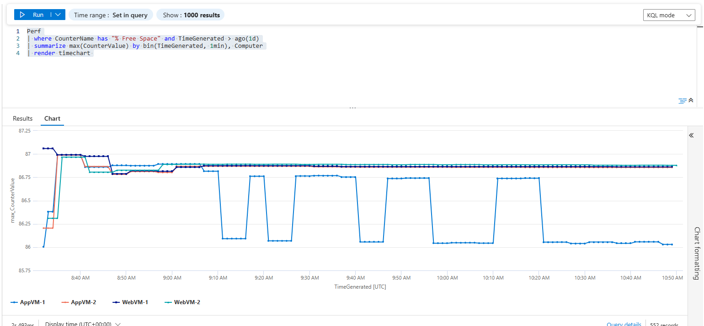
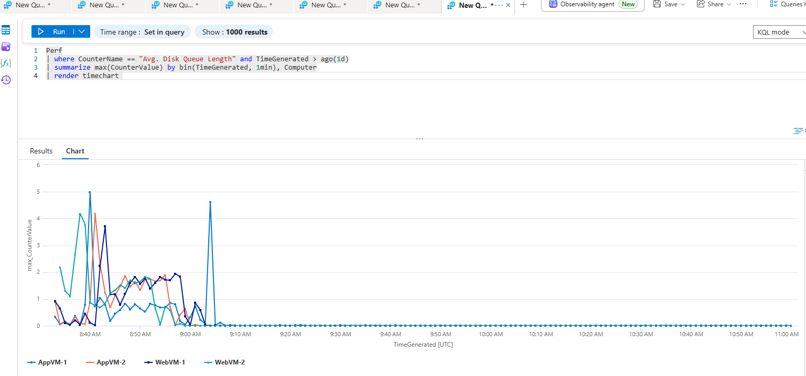
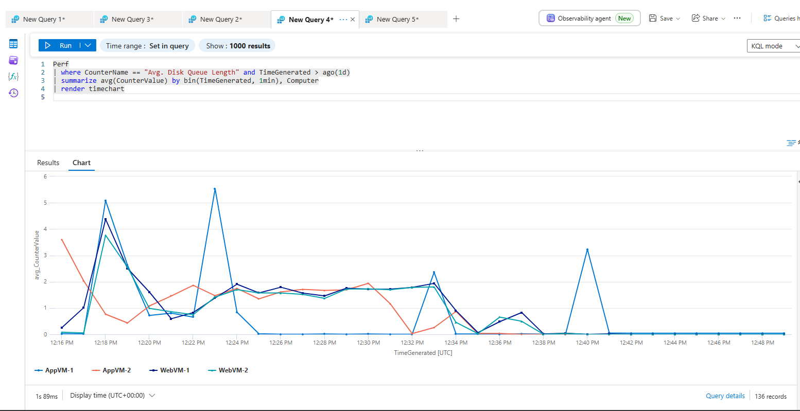
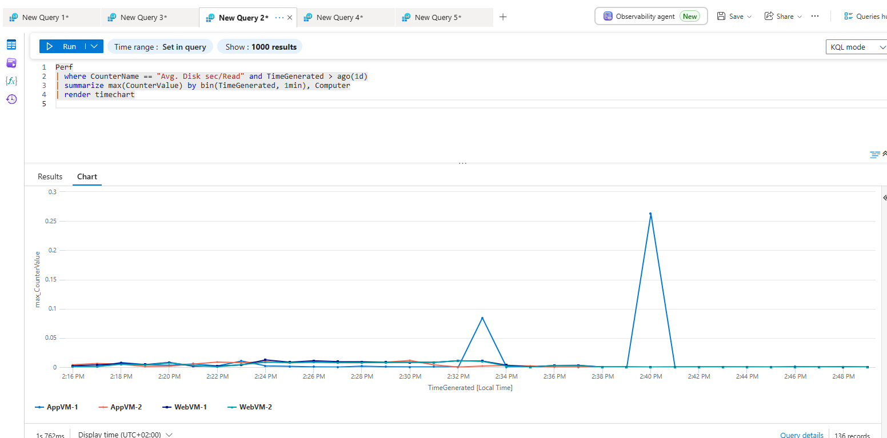

# Scenario 03 – Disk Performance Degradation

## Ticket

Users report that an application hosted on AppVM-1 has become significantly slower. CPU and memory do not immediately appear abnormal. Investigate whether disk performance could be contributing to the problem.

## Investigation Objectives

The objective is to determine whether disk performance is contributing to the reported application degradation.

The investigation focuses on:

•	Read/write activity.

•	Disk I/O and throughput.

•	Disk latency.

•	Disk queue length.

•	Disk capacity.

•	CPU and memory usage.

•	Network performance.

•	Application and system events.

•	Time correlation between disk activity and application errors.

•	Comparison with other VMs.

The main troubleshooting question is whether the observed behaviour can be distinguished from general VM resource pressure.

## Lab Simulation

Disk activity was generated using PowerShell to create, remove and copy files repeatedly.

while ($true)

{
    fsutil file createnew C:\Temp\testfile.bin 1000000000
    Remove-Item C:\Temp\testfile.bin
}

A second approach was also tested:

while ($true)

{
    Copy-Item C:\Temp\BigFile.bin C:\Temp\Copy.bin -Force
}

Application errors were also generated during the simulated disk activity to provide additional data for correlation.

## Investigation

### 1. Check whether the VMs are reporting

The latest heartbeat from each VM was checked to confirm that telemetry was being received.

Heartbeat

| summarize max(TimeGenerated) by Computer

### 2. Check CPU and memory

CPU and memory were investigated first to determine whether general VM resource pressure could explain the application degradation.

Perf

| where TimeGenerated > ago(1d)

| where CounterName == "% Processor Time"

| summarize avg(CounterValue) by bin(TimeGenerated, 2m), Computer

| render timechart

Perf

| where TimeGenerated > ago(1d)

| where CounterName == "Available Bytes"

| summarize avg(CounterValue) by bin(TimeGenerated, 2m), Computer

| render timechart

Maximum CPU and memory values were also reviewed during the investigation.

### 3. Review available network performance data

Available network performance counters were checked to identify metrics that could be used to investigate whether networking was contributing to the application degradation.

Perf

| where ObjectName contains "Network"

| summarize count() by CounterName

Network performance was then considered alongside the other VM resources.

### 4. Identify relevant disk performance counters

The disk-related counters available in the collected performance telemetry were reviewed.

The main counters selected for investigation were:

•	Avg. Disk Queue Length

•	Avg. Disk sec/Read

•	Avg. Disk sec/Write

•	Disk Read Bytes/sec

•	Disk Write Bytes/sec

These provide information about disk queueing, read/write latency and disk throughput.

### 5. Check disk capacity

Disk free space was reviewed to determine whether the problem could instead be related to insufficient disk capacity.

Perf

| where CounterName has "% Free Space" and TimeGenerated > ago(1d)

| summarize max(CounterValue) by bin(TimeGenerated, 1m), Computer

| render timechart

The disk capacity of AppVM-1 was compared with other VMs.

### 6. Investigate disk queue length

Disk queue length was investigated to look for potential disk bottlenecks.

Perf

| where CounterName == "Avg. Disk Queue Length" and TimeGenerated > ago(1d)

| summarize max(CounterValue) by bin(TimeGenerated, 1m), Computer

| render timechart

Average queue length was also reviewed:

Perf

| where CounterName == "Avg. Disk Queue Length"

| where TimeGenerated > ago(1d)

| summarize avg(CounterValue) by bin(TimeGenerated, 1m), Computer

| render timechart

### 7. Investigate disk latency

Read and write latency were investigated separately.

Perf

| where CounterName == "Avg. Disk sec/Read" and TimeGenerated > ago(1d)

| summarize max(CounterValue) by bin(TimeGenerated, 1m), Computer

| render timechart

Perf

| where CounterName == "Avg. Disk sec/Write"

| where TimeGenerated > ago(1d)

| summarize avg(CounterValue) by bin(TimeGenerated, 1m), Computer

| render timechart

### 8. Investigate disk throughput

Read and write throughput were also reviewed.

Perf

| where CounterName == "Disk Read Bytes/sec"

| where TimeGenerated > ago(1d)

| summarize avg(CounterValue) by bin(TimeGenerated, 1m), Computer

| render timechart

Perf

| where CounterName == "Disk Write Bytes/sec"

| where TimeGenerated > ago(1d)

| summarize avg(CounterValue) by bin(TimeGenerated, 1m), Computer

| render timechart

### 9. Correlate disk performance with application errors

To investigate whether increased disk latency occurred alongside application errors, a correlation query was created.

The following query was initially generated with AI and then modified for this scenario:

union

(
    Perf
    | where CounterName == "Avg. Disk sec/Write"
    | where Computer == "AppVM-1"
    | where CounterValue > 0.05
    | project TimeGenerated,
              Computer,
              Type = "DiskLatency",
              Details = tostring(CounterValue)
),

(
    Event
    | where EventLevelName == "Error"
    | where Computer == "AppVM-1"
    | project TimeGenerated,
              Computer,
              Type = "AppError",
              Details = RenderedDescription
)

| sort by TimeGenerated asc

A second query was also used to identify whether a VM had both elevated disk queue length and application-level warning or error events:

Perf

| where TimeGenerated > ago(24h)

| where CounterName has "Avg. Disk Queue Length"

| where CounterValue > 0.5

| distinct Computer

| join kind=inner (
    Event
    | where TimeGenerated > ago(24h)
    | where EventLog has "Application"
    | where EventLevelName in ("Warning", "Error", "Critical")
    | distinct Computer
    
) on Computer

| project Computer,
          JoinResult = "Has both Avg. Disk Queue Length above 0.5 and Warning, Error or Critical events"
          
### 10. Investigate Events

Windows Event Logs were reviewed for application and system errors around the time of the suspected performance degradation.

Event

| where EventLevelName in ("Error", "Warning")

| where Computer == "AppVM-1"

## Findings

CPU and memory usage did not appear abnormal during the investigation.
Disk space was not depleted, but differences in disk behaviour were observed on APPVM-1 compared with the other VMs.
Further investigation of disk performance showed an increased disk queue length. Application write errors were also found in the Event table during a similar time period.
The correlation between increased disk queue length and application write errors strongly suggests that disk performance contributed to the reported application degradation.

## Conclusion

The investigation identified evidence of disk performance degradation while CPU, memory and disk capacity did not appear to be the primary issue.
The observed increase in disk queue length together with application write errors indicates that disk I/O performance is a likely contributor to the application slowdown.
The exact process responsible for the increased disk activity was not identified during this investigation.

## Recommended Next Steps

Based on the findings, the next step would be to investigate which processes are generating the disk activity and what is causing the disk overload.
If the existing disk configuration cannot provide sufficient performance for the workload, the size and performance characteristics of the disk could also be reviewed and scaling considered.
